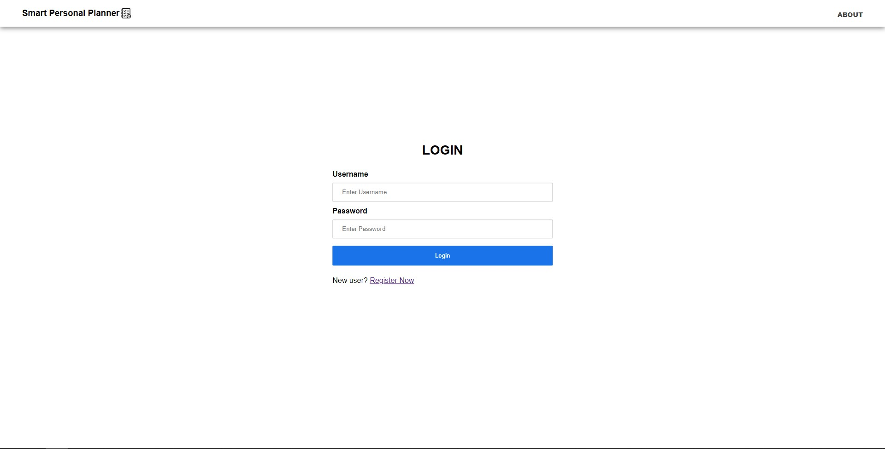
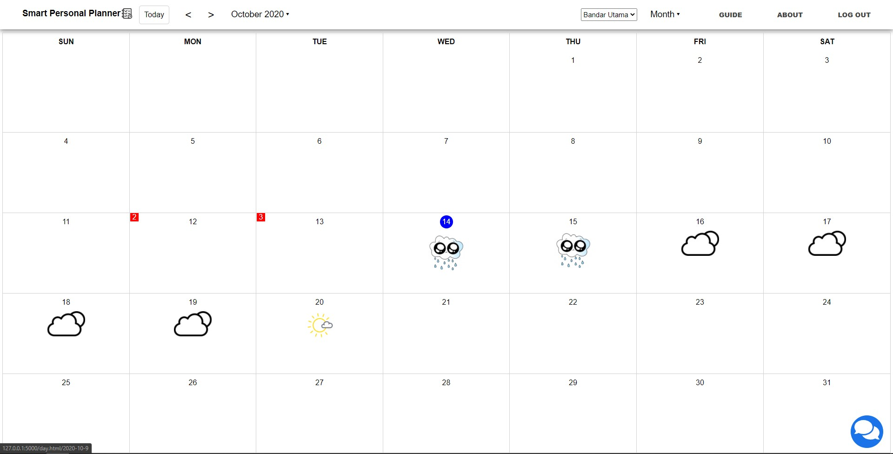
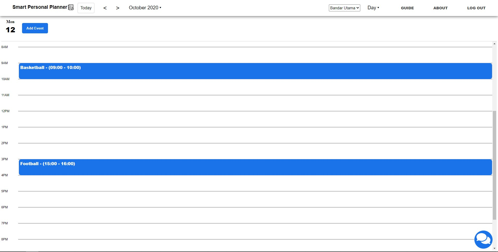
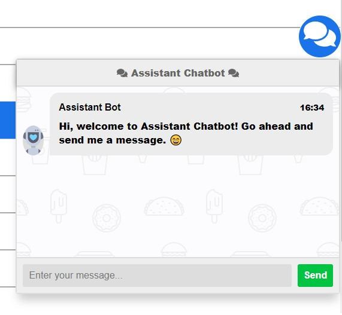

# Smart-Personal-Planner-with-Weather-Forecast
Imagine if you have planned an outdoor activity for so long by trying to arrange the other activities at the same time without overlapping any of them, and then it happens to be raining on that day which makes a mess towards your plans and your mood. Smart Personal Planner is an application that will solve this type of problem by getting information from the weather forecast beforehand so the user will not plan an outdoor activity on a raining day. However, the weather forecast can be inaccurate sometimes where the accuracy of it is 90 percent for a 5-day forecast, 80 percent for a 7-day forecast and 50 percent or lower for a 10-day or more forecast according to the research. Thus, if an outdoor activity just happened to be scheduled on a raining day, the application will reschedule the outdoor activities that are unable to be carried out to the next most suitable time slot or swapping the next activity with them after getting user’s permission.
	
Besides that, time management is a very challenging task to do for everyone, no matter you are a student, teacher or one’s parent as you always want your work to be perform in a high-quality form as well as in less time. With the help of Smart Personal Planner, the user is able to manage his or her time effectively by scheduling their upcoming activities at date and time they desired without overlapping two activities that are happening at the same time. When two activities are overlapping with each other, the application will help the user to reschedule the activity that has a lower priority to another time slot. To reduce the complexity of the application, the user can provide as less information of the activity as possible and the application will still be able to schedule the activity at the most suitable time slot.
	
With the help of Natural Language Processing (NLP), Smart Personal Planner will be able to extract information from the messages in Facebook Messenger and schedule any upcoming activities that are detected in the calendar after the user approved them, so the user does not need insert the information of the activities manually. Last but not least, Smart Personal Planner also uses a dialogue system in it as the main interaction to allow the user to provide the information of the activities in a human speech-like form, thus it makes the application so much easier to use and increase the interactivity between the application and the user.

## File Link
https://drive.google.com/file/d/1uzom7fcg-j7iaG3lVnphfh0vbtych0ck/view?usp=sharing

## Screenshots

